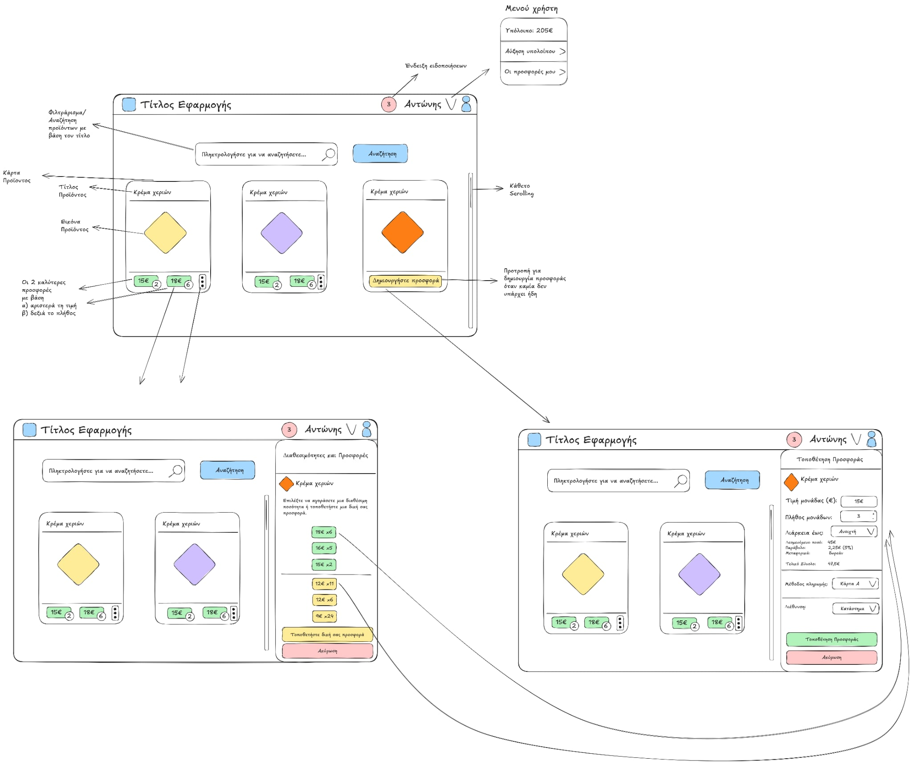
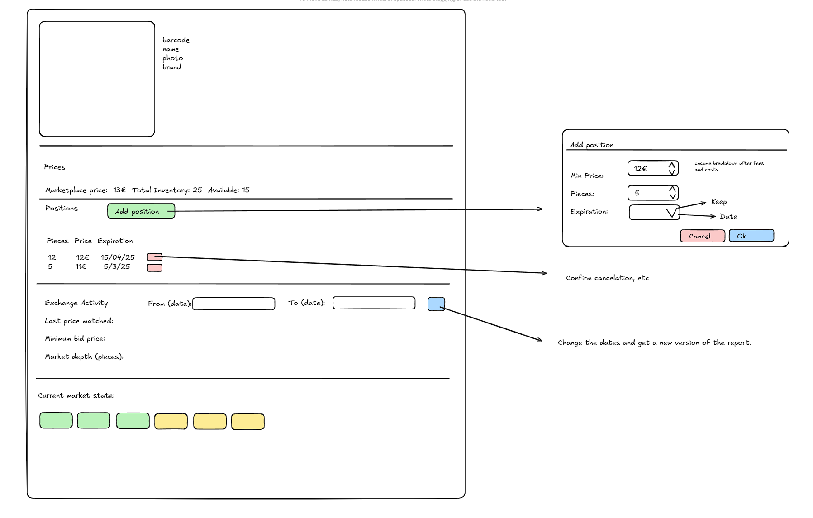

# Bet Exchange

## Features
### For the Buyer:
- Login
- Logout
- Notifications
- View products
- Create a new offer
- Purchase an existing offer
- Search for products
- View balance

---

### For the Seller:
- Login
- Logout
- Notifications
- View listed products
- View product details
- Add new positions
- Remove existing positions
- Check exchange activity
- View market state
- Accept an offer
---

## Requirements for the Buyer

### Logging In
#### Requirements:
- When the user opens the app, then they should be prompted to choose a role to log in with (either Buyer or Seller).
- When the user clicks either the "Buyer" or the "Seller" button, then they should be logged into the app and granted access.

---

### Logging Out
#### Prerequisites:
- User must be logged in.

#### Requirements:
- When the user clicks the Logout button, then they should be logged out and redirected to the login screen.

---

### Notifications
#### Prerequisites:
- User must be logged in.

#### Requirements:
- A navigation bar with the following elements should exist: title of the page, notifications icon, username and a user icon.
- When the user clicks the notifications button, then all his notifications should be displayed.

#### Edge Cases:
- If the number of notifications is zero, display a message.

---

### Viewing Products
#### Prerequisites:
- User must be logged in.
- At least one product should exist.

#### Requirements:
- When the user visits the main page, all available products should be displayed.
- Every product should have a title, image and two offers visible or a button to create one.
- Every product should showcase the two best offers, one based on price and one based on quantity.
- Every product should have a button that opens a modal with all the offers and a "Create your offer" button.

#### Edge Cases:
- If no products are available, an appropriate message should be displayed.

---

### Creating a New Offer
#### Prerequisites:
- User must be logged in.
- At least one product should exist.
- Sufficient balance to place an offer.

#### Requirements:
- When the user clicks on "Create Offer" and enters a valid quantity, price, duration, payment method, address and has enough balance then the offer should be created.
- When the user places a new offer, their balance should update, subtracting the amount from their funds.
- When the user places a new offer, they should receive the appropriate notification.
- When the user enters a negative number or the number zero in any of the input fields, then an error should be displayed.

#### Edge Cases:
- If the user attempts to place an offer without enough balance, an error should be displayed.
- If the user attempts to place an offer with a negative value,  an error should be displayed.

---

### Purchasing an Existing Offer
#### Prerequisites:
- User must be logged in.
- Sufficient balance to place an offer.
- At least one product should exist.
- The offer must still be available at the time of purchase.

#### Requirements:
- When the user clicks on an existing offer, then the "new offer" form should appear with its fields pre-completed (based on the existing offer).
- Upon submission, the user should receive the appropriate notification.
- Upon submission, the corresponding position's status should be updated.

#### Edge Cases:
- If the user attempts to place an offer without enough balance, an error should be displayed.
- if the user attempts to place an offer with a negative value,  an error should be displayed.

---

### Searching for Products
#### Prerequisites:
- User must be logged in.
- There must be products available in the marketplace.

#### Requirements:
- When the user enters a valid search term in the search bar, relevant products should be displayed.

#### Edge Cases:
- If no products match the search term, a message should be displayed.
- If the search input is empty, all products should be shown.

---

### Viewing Balance
#### Prerequisites:
- User must be logged in.

#### Requirements:
- When the user clicks on the user profile icon, their balance should be displayed.

---


## Requirements for the Seller

### Logging In
#### Requirements:
- Same as "For the Buyer".

---

### Logging Out
#### Requirements:
- Same as "For the Buyer".
---

### Notifications
#### Prerequisites:
- User must be logged in.

#### Requirements:
- A navigation bar with the following elements should exist: title of the page, notifications icon, username, and a user icon.
- When a user’s position receives an offer, a relevant notification should be sent.
- When a user's position gets sold, a relevant notification should be sent.
- When a user adds a new position, a relevant notification should be sent.

---

### Viewing Listed Products
#### Prerequisites:
- User must be logged in.
- At least one product should exist.

#### Requirements:
- When the user navigates to the main page, all their listed products should be displayed.
- Each listed product should show its title, barcode, brand and image.
- Each listed product should have a button to view product details.

#### Edge Cases:
- If the seller has no listed products, an appropriate message should be displayed.

---

### Viewing Product Details
#### Prerequisites:
- User must be logged in.
- At least one product should exist.

#### Requirements:
- When the user selects a listed product, a detailed page should display  its title, barcode, brand and image.
- A "prices" section should exist and display marketplace price, total inventory and the number of items available in the market.
- A "positions" section should exist and display a table with Pieces, Price and Expiration for each product.
- A "Add position" button should also exist in the "positions" section.
- A "exchange activity" section should exist, displaying information for the products based on a specified time period.
- A "current market state" section should exist, displaying positions and offers for the product from the market.

---

### Adding New Positions
#### Prerequisites:
- User must be logged in.
- At least one product should exist.
- User must be on the product details page of a position.

#### Requirements:
- When the user clicks "Add position" and enters a valid minimum price, number of pieces and expiration date, a new position is added.
- The seller should receive a notification confirming the listing.
- The seller’s dashboard should update with the new listing.

#### Edge Cases:
- If required fields are left empty or are invalid(negative number or 0), an error should be displayed.

---

### Removing Existing Positions
#### Prerequisites:
- User must be logged in.
- At least one product should exist.
- User must be on the product details page of a position.

#### Requirements:
- When the user selects a position and clicks "Remove Position," the product should be removed from the marketplace.
- A confirmation message should appear before removal.
- The seller should receive a notification confirming the removal.
- The seller’s dashboard should update and no longer display the removed position.

#### Edge Cases:
- If the position has active offers, a warning should be displayed before allowing removal.

---

### Checking Exchange Activity
#### Prerequisites:
- User must be logged in.
- At least one product should exist.
- User must be on the product details page of a position.

#### Requirements:
- When the seller navigates to the exchange activity section, they can specify a time period and receive the following information about a product: "Latest price matched", "Minimum bid price" and "Market depth (pieces)".


#### Edge Cases:
- If no recent transactions are available, a message should indicate that no activity has occurred.

---

### Viewing Market State
#### Prerequisites:
- User must be logged in.
- At least one product should exist.
- User must be on the product details page of a position.

#### Requirements:
- When the seller navigates to the market state section, they should see a summary of active offers and positions for the specified product.

#### Edge Cases:
- If no market data is available, a message should indicate that there is currently no market activity.

---

### Accepting an offer
#### Prerequisites:
- User must be logged in.
- At least one product should exist.
- User must be on the product details page of a position.
- At least one offer for the product should exist.

#### Requirements:
- When the seller clicks on an offer at the market state section, a new "Add position" form should be displayed with the fields pre-completed (based on the selected offer).
- Upon submission, the user should receive the appropriate notification.
- Upon submission, the corresponding offer's status should be updated.

### Edge Cases:
- If the offer is no longer available by the time the seller attempts to accept it, display an error message.

---

## Implementation Plan
### Entities
#### User
```
type User = {
  id: number;
  username: string;
  role: 'buyer' | 'seller';
  balance: number;
};
```
---

#### Product
```
type Product = {
  id: number;
  title: string;
  imageUrl: string;
  description?: string;
  offers: Offer[];
  bestPriceOffer?: Offer;
  bestQuantityOffer?: Offer;
};
```
---

#### Offer
```
type Offer = {
  id: number;
  productId: number;
  creatorId: number;
  quantity: number;
  price: number;
  duration: Date;
  paymentMethod: string;
  address: string;
  status: 'open' | 'accepted' | 'expired';
};
```
---

#### Position
```
type Position = {
  id: number;
  productId: number;
  sellerId: number;
  pieces: number;
  minPrice: number;
  expirationDate: Date;
  status: 'open' | 'accepted' | 'expired';
};
```

---

#### Notification
```
type Notification = {
  id: number;
  userId: number;
  message: string;
  timestamp: Timestamp;
  read: boolean;
};
```

---

#### Exchange Activity
```
type ExchangeActivity = {
  productId: number;
  latestPriceMatched: number;
  minBidPrice: number;
  marketDepth: number;
};
```

---

### Data Management
#### Local Storage:
- LocalStorage will be used for the storage and retrieval of entities (users, products, offers etc.) and all CRUD operations.

#### Local Storage Keys:
- Users – Stores user information.
- AuthUser - Stores the authenticated user.
- Products – Stores product listings.
- Offers – Stores buy/sell offers.
- Positions – Stores seller positions.
- Notifications – Stores user notifications.
- ExchangeActivities - Stores exchange activity for products.

---

### "API" Methods:
#### Login
- Signs in the user based on the selected role.
- Sets the local storage value that holds the authenticated user.
- `login = (username: string)`
#### Logout
- Clears the local storage value that holds the authenticated user.
- `logout= ()`

#### Get Products
- Retrieves all stored products.
- Returns an array of products.
- `getProducts = ()`

#### Get Product By ID
- Finds a product based on its **productId**.
- Returns the product if found, otherwise null.
- `getProductById = (productId: number)`

#### Create Offer
- Adds a new offer to local storage.
- Updates the stored list and returns the created offer.
- `createOffer = (offer: Offer)`

#### Purchase Offer
- Finds an offer by **offerId** and checks if it's still available (open status).
- Updates its status to accepted.
- Returns the updated offer if successful, otherwise null.
- `purchaseOffer = (offerId: number)`

#### Get Positions by sellerId
- Finds all positions based on a **sellerId**.
- Returns an array of positions.
- `getPositionsBySellerId =( sellerId: number)`.

#### Add Position
- Adds a new position for a seller.
- Updates local storage and returns the created position.
- `addPosition = (position: Position)`

#### Remove Position
- Removes a position from local storage using its **positionId**.
- Updates the stored list after removal.
- `removePosition = (positionId: number)`

#### Get Notifications
- Retrieves notifications for a specific **userId**.
- Returns an array of notifications.
- `getNotifications = (userId: number)`

#### Add Notification
- Adds a new notification to the user's notification list.
- Updates local storage and returns the created notification.
- `addNotification = (notification: Notification, userId: number)`

#### Get Market State
- Gathers and summarizes market data for a specific **productId**.
- Returns:
  - **latestPriceMatched**: The most recent matched price.
  - **minBidPrice**: The lowest available offer price.
  - **marketDepth**: Total quantity of items available.
- If no market data exists, returns null.
- `getMarketState = (productId: number)`

---

### State Management & Routing
#### State Management:
- **Global State**: React Context.
- **Local State**: React hooks (useState).

#### Routing:
- React Router
- Routes:
    - /login
    - /buyer (protected)
    - /seller (protected)
    - /product/:id (protected)

---

### UI Design
#### Mockups for the Pages:




---

### Time Estimation (38 hours total):
- Initializing and setting up the project (1 hour).
- Setting up the local storage, creating data etc. (2 hours).

- Implementing **Login/Logout** (2 hours).
- Implementing **Notifications** (3 hours).
- Implementing **View products** (3 hours).
- Implementing **Create a new offer** (3 hours).
- Implementing **Purchase an existing offer** (2 hours).
- Implementing **Search for products** (3 hours).
- Implementing **View balance** (2 hours).

- Implementing **View listed products** (2 hours).
- Implementing **View product details** (3 hours).
- Implementing **Add new positions** (2 hours).
- Implementing **Remove existing positions** (2 hours).
- Implementing **Check exchange activity** (3 hours).
- Implementing **View market state** (3 hours).
- Implementing **Accept an offer** (2 hours).
